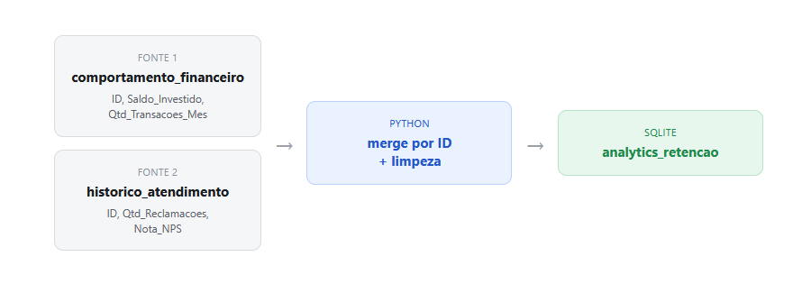
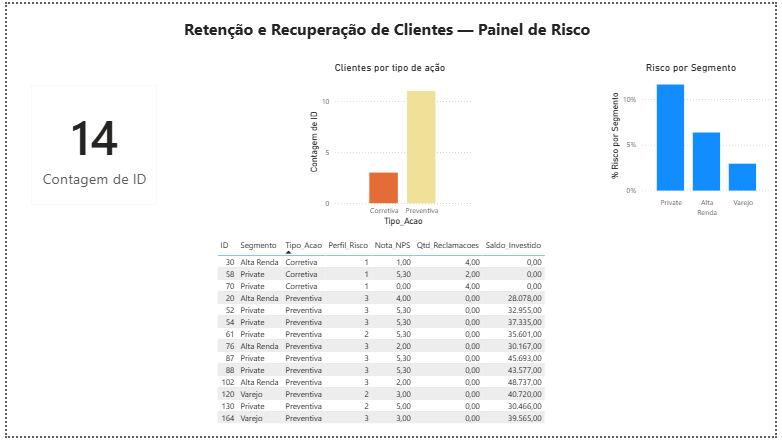

# Retenção e Recuperação de Clientes (Caso XP)

Projeto de análise de dados que simula um problema real do mercado financeiro: identificar sinais de risco de evasão de clientes antes que a saída aconteça, cruzando comportamento financeiro e histórico de atendimento.

## Contexto de Mercado

A XP Inc., empresa que inspira este case, reportou queda em seu Net Promoter Score (NPS) três anos seguidos: de 72 pontos em 2023 para 65 em 2025, segundo seu relatório anual (Form 20-F) enviado à SEC ([fonte primária](https://www.sec.gov/Archives/edgar/data/1787425/000207097926000182/xp-20251231.htm)). Essa queda acontece num momento de maior instabilidade no mercado de crédito brasileiro. Casos como Ambipar, Braskem e a liquidação do Banco Master, em 2025, geraram comparações com a crise de crédito provocada pelo colapso da Americanas em 2023 ([fonte](https://investnews.com.br/negocios/ambipar-braskem-banco-master-credito/)). Diante desse cenário, tratar o NPS como um indicador acionável, e não apenas uma métrica de vaidade reportada a cada trimestre, deixou de ser opcional. Este projeto nasce dessa dor real: transformar sinais de comportamento do cliente (saldo, movimentação, reclamações, satisfação) em um alerta de risco de evasão antes que o cliente efetivamente saia, permitindo que o time de relacionamento aja a tempo.

## Objetivo Técnico

Construir um pipeline de dados que centraliza informações de duas naturezas diferentes, comportamento financeiro e histórico de atendimento, e aplica regras de negócio para identificar clientes de alto valor com sinais de insatisfação, mesmo quando esses sinais não são óbvios (ex: cliente que nunca abriu uma reclamação formal).

## Arquitetura do Pipeline

Duas fontes são geradas separadamente, simulando dois sistemas diferentes de uma empresa real (um sistema de investimentos e um sistema de CRM/suporte): `comportamento_financeiro` e `historico_atendimento`. Ambas passam por um pipeline em Python que faz o merge pelo `ID` do cliente e aplica as regras de limpeza. O resultado final é persistido na tabela `analytics_retencao`, no SQLite.

## Fontes de Dados e Campos

**`comportamento_financeiro`**
- `ID`
- `Segmento` (Varejo, Alta Renda, Private)
- `Saldo_Investido`
- `Qtd_Transacoes_Mes`
- `Data_Ultima_Transacao`

**`historico_atendimento`**
- `ID`
- `Qtd_Reclamacoes`
- `Nota_NPS`

## Regras de Limpeza Aplicadas

- **Nota de satisfação ausente:** em vez de descartar o cliente, a nota é substituída pela média das notas válidas da base, para não perder o cliente da análise.
- **Saldo investido igual a zero:** tratado de forma diferenciada usando a data da última transação. Um saldo zerado sem nenhum histórico de transação é considerado erro de sistema (cliente descartado). Um saldo zerado com transação registrada no passado é mantido como sinal real de evasão em andamento.

## Lógica de Identificação de Risco

A identificação usa subqueries correlacionadas em SQL, comparando cada cliente com a média do seu próprio segmento (não a média geral da base), já que o que é "alto" ou "baixo" varia por perfil de cliente. Três perfis de risco foram definidos:

1. **Saldo zerado com reclamação:** saldo investido igual a zero, ao menos uma reclamação aberta, e nota de satisfação abaixo da média do segmento.
2. **Cliente silencioso, valioso e insatisfeito:** saldo acima da média do segmento, nota abaixo da média do segmento, mas nenhuma reclamação formal registrada.
3. **Cliente valioso em queda de engajamento:** saldo acima da média do segmento, número de transações no mês abaixo da média do segmento, nota abaixo da média do segmento, sem reclamação formal.

## Resultados Encontrados

Em uma base de 200 clientes simulados (com semente aleatória fixa, para reprodutibilidade), a consulta identificou 14 clientes de risco (7% da base), uma proporção consistente com o esperado para um sistema de alerta: nem excessivo, nem irrelevante.

Os clientes de risco se dividem em duas naturezas de ação:
- **Ação corretiva (3 clientes):** saldo zerado com histórico de transação e reclamação registrada. Sinal de evasão já em andamento, que exige contato imediato.
- **Ação preventiva (11 clientes):** saldo acima da média do segmento e nota de satisfação baixa, sem reclamação formal. Sinal de insatisfação silenciosa, que exige monitoramento antes que a evasão se concretize.

Essa divisão existe porque as duas naturezas de risco são estruturalmente diferentes. Um cliente com saldo zero nunca pode, ao mesmo tempo, ter saldo acima da média do seu segmento (o saldo nunca é negativo), então os dois grupos nunca competem pelo mesmo cliente. Cada perfil de risco identificado (1, 2 ou 3) é preservado numa coluna própria (`Perfil_Risco`), além da classificação agregada (`Tipo_Acao`), para manter a explicabilidade de qual regra específica sinalizou cada cliente.

## Dashboard (Power BI)

A lógica de risco foi transformada em um painel visual para consumo por um time de relacionamento com clientes.

**Camada de dados dedicada ao dashboard:** em vez de conectar o Power BI direto na tabela bruta (`analytics_retencao`), a lógica de risco foi materializada numa tabela própria (`clientes_risco_dashboard`), gerada a partir de uma query SQL isolada (`clientes_risco_dashboard.sql`) e persistida automaticamente pelo pipeline Python (`criar_tabela_dashboard()`, chamada logo após `salvar_no_banco`). Essa separação evita duplicar a lógica de risco como medidas DAX dentro da ferramenta de BI: a regra de negócio continua vivendo em um único lugar, auditável em SQL.

**Estrutura do painel:**
- Um cartão de KPI com o total de clientes de risco.
- Um gráfico comparando `Corretiva` vs `Preventiva`, ordenado por urgência de ação (não por volume).
- Um gráfico de percentual de risco por segmento, usando uma medida DAX (`DIVIDE` com `CALCULATE`) em vez de contagem absoluta, o que evita a distorção de um segmento parecer "mais arriscado" só por ter mais clientes no total.
- Uma tabela nominal com os 14 clientes de risco, para ação direta do time.

O arquivo do relatório está disponível em [`powerbi/clientes_risco_dashboard.pbix`](powerbi/clientes_risco_dashboard.pbix) (requer Power BI Desktop para abrir) e uma versão estática em [`powerbi/clientes_risco_dashboard.pdf`](powerbi/clientes_risco_dashboard.pdf), para visualização sem precisar instalar nada. O `.pbix` foi conectado em modo de importação, então carrega uma cópia dos 200 registros sintéticos. Sem problema aqui, já que os dados não são reais, mas é um ponto de atenção que valeria levar para qualquer projeto com dados de clientes de verdade.

## Apresentação de Negócio

O mesmo resultado técnico foi traduzido para duas audiências diferentes, cada uma com uma pergunta diferente sobre o projeto:

- [`apresentacoes/retencao_apresentacao_negocio.pptx`](apresentacoes/retencao_apresentacao_negocio.pptx): deck de 5 slides para liderança, sem jargão técnico, fechando com uma recomendação de ação sobre a concentração de risco no segmento Private.
- [`apresentacoes/guia_time_relacionamento.docx`](apresentacoes/guia_time_relacionamento.docx): guia de uma página para o time de relacionamento, traduzindo os alertas em prazo de contato e roteiro de abordagem por situação do cliente.

Nenhum dos dois reproduz a metodologia (SQL, DAX, pipeline). Cada um foi calibrado para o que a audiência correspondente realmente precisa decidir ou fazer, não para demonstrar o processo técnico.

## Tecnologias Utilizadas

- Python (geração e tratamento de dados)
- SQLite (persistência e consultas analíticas)
- SQL (subqueries correlacionadas)
- Power BI (dashboard e medidas DAX)

## Limitações e Aproximação com o Trabalho Real

Este projeto foi construído com fins de aprendizado, e algumas escolhas foram feitas para focar no raciocínio analítico, não na infraestrutura de produção. Vale registrar onde ele reflete o trabalho real de um profissional de dados e onde ele é uma simplificação didática.

**Alinhado com a prática real:**
- Integrar dados de sistemas diferentes (comportamento financeiro e atendimento) reflete um desafio comum do dia a dia: dados raramente chegam prontos em uma única fonte.
- As regras de negócio aplicadas na limpeza (estimar nota neutra em vez de descartar cliente, diferenciar erro de sistema de evasão real usando a data da última transação) representam o tipo de julgamento que se espera de um analista, não apenas execução técnica.
- Comparar cada cliente com a média do próprio segmento, em vez de uma média geral, é uma prática analítica real e evita conclusões distorcidas.
- Priorizar regras explicáveis (em vez de um modelo de caixa-preta) é uma escolha comum em contextos de risco e compliance no mercado financeiro, onde é preciso justificar por que um cliente foi sinalizado.

**Simplificações didáticas, não representativas do ambiente de produção:**
- Os dados foram gerados sinteticamente. Em produção, a sujeira dos dados não é conhecida de antemão, ela é descoberta aos poucos.
- A união e o tratamento das fontes foram feitos com estruturas manuais em Python (loops e dicionários), para deixar a lógica explícita durante o aprendizado. Em um ambiente real, isso seria feito com bibliotecas como pandas.
- Os dados foram persistidos em SQLite local. Em produção, normalmente estariam em um Data Warehouse corporativo (ex: Snowflake, BigQuery, Databricks).
- A definição dos perfis de risco foi feita individualmente, sem ciclo de validação com um time de negócio. No ambiente real, essas regras seriam construídas e ajustadas em conjunto com quem vai agir sobre os alertas.

**Fricção real encontrada mesmo em escala pequena:**
- Conectar o Power BI a um banco SQLite não é uma integração pronta. Exigiu instalar um driver ODBC separado e configurar uma fonte de dados nomeada (DSN) no Windows, um lembrete de que integração entre ferramentas raramente é plug-and-play, mesmo fora de um ambiente corporativo.
